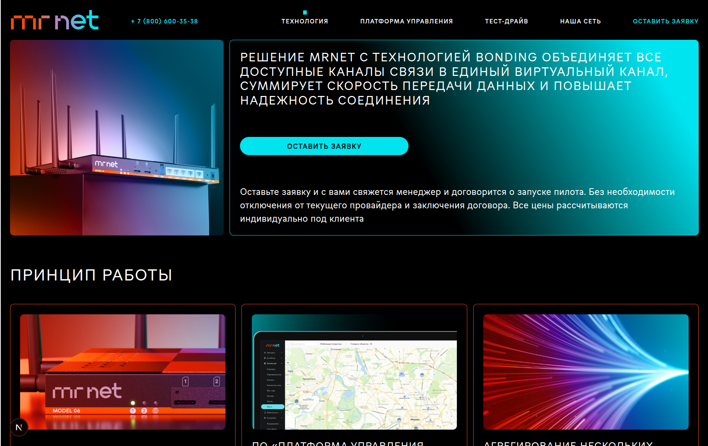
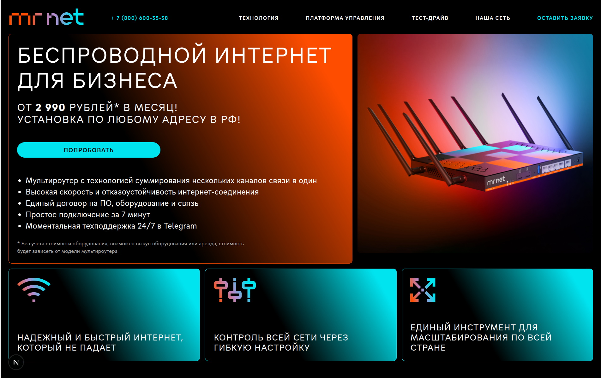

# Тестовое задание для Frontend разработчика в Korlab

## Описание проекта

Страница лендинга для Корлаба.

## Технологии

- Next.js
- TypeScript
- Tailwind CSS (для стилизации)

## Демо

Рабочая версия приложения доступна по ссылке:
[Демо приложения](https://test-task-korlab.vercel.app/)

## Screenshots

  

